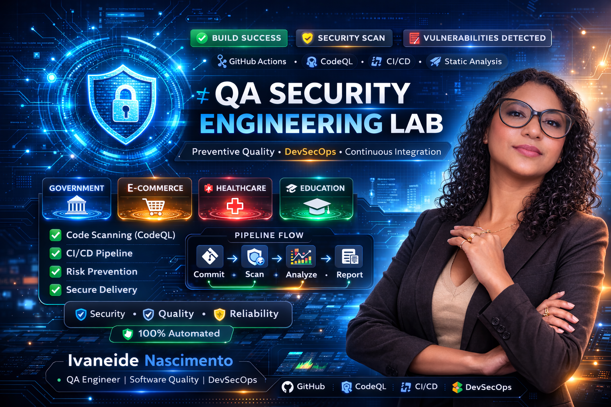

  

Hands-on engineering project focused on automated security validation and preventive quality practices using GitHub Actions and CodeQL.

  
  
  
  

---

  

Hands-on engineering project focused on automated security validation and preventive quality practices using GitHub Actions and CodeQL.

  
  
  
  

---

## 🌎 Engineering Context

Modern software delivery requires **continuous security validation**, proactive risk mitigation strategies and preventive quality engineering practices.
This project simulates a real engineering scenario where QA contributes strategically to **software resilience**, embedding automated static analysis into CI pipelines aligned with modern **DevSecOps culture**.

---

## 🎯 Project Objective

Design and implement an automated **security scanning workflow** capable of:

* Detecting vulnerabilities early in the development lifecycle
* Reducing risk exposure before production deployment
* Increasing software reliability and maintainability
* Supporting engineering decision-making through risk analysis
* Promoting a strong **Shift-Left quality strategy**

---

## ⚙️ Technology Stack & Engineering Practices

### 🔧 Technologies

* GitHub Actions — CI pipeline orchestration
* CodeQL — Static Application Security Testing (SAST)
* YAML — workflow configuration
* JavaScript (Node.js) — vulnerable sample application

### 🧠 Engineering Practices

* Secure Software Development Lifecycle (SSDLC)
* Preventive Quality Engineering mindset
* DevSecOps collaborative culture
* Continuous Integration quality validation
* Risk-based testing strategy

---

## 🔄 Secure CI Pipeline Flow

1️⃣ Developer pushes code changes
2️⃣ GitHub Actions pipeline is automatically triggered
3️⃣ CodeQL executes static security analysis
4️⃣ Vulnerability insights are generated in Security tab
5️⃣ QA supports risk evaluation and quality governance decisions

This workflow enables **continuous security intelligence and proactive quality control** across the software delivery lifecycle.

---

## 📸 Pipeline Execution Evidence

  

---

## 🧠 Key Engineering Learnings

* Strategic understanding of CI/CD pipelines from a QA engineering perspective
* Integration of security validation into modern software delivery lifecycle
* Preventive defect detection and early risk containment approach
* Cross-functional collaboration between QA, DevOps and Security teams
* Engineering mindset focused on system reliability, resilience and governance

---

## 🚀 Future Evolution

* Integration with automated functional testing stages
* Multi-language security scanning expansion
* Security alert triage simulation workflow
* Quality metrics dashboard and observability layer
* Risk-based CI quality gates implementation

---

## 👩‍💻 Author

**Ivaneide Nascimento**
QA Engineer | Test Automation | Software Quality | CI/CD | DevSecOps

Building practical engineering labs to simulate **real-world quality challenges and modern software delivery scenarios.**

QA Engineer | Test Automation | Software Quality | CI/CD | DevSecOps

Building practical engineering labs to simulate **real-world quality challenges and modern software delivery scenarios.**

